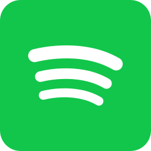

<p align="center" width="100%">
    
</p>

# STICLI [](https://github.com/dichternebel/sticli/blob/main/LICENSE)
Store information about your currently played Spotify track for further use.

This .Net Core console app gathers information from Spotify API and stores them into text and image files that can then be used e.g. within OBS. You might see this as an alternative to [OBS Tuna](https://obsproject.com/forum/resources/tuna.843/) or [SNIP](https://github.com/dlrudie/Snip) when using Spotify.
## Prerequisites

- A Spotify (Premium?) account.
- A registered [Spotify app](https://developer.spotify.com/documentation/general/guides/authorization/app-settings/) with callback `http://localhost:5000/spotifyCallback` and it's ClientID.
- This thing downloaded from the [releases section](https://github.com/dichternebel/sticli/releases).

## Setting things up
Once you downloaded the zip file extract the two files to wherever you want. Might be e.g. `C:\Tools\STICLI\`.
Now open the `STICLI.dll.config` e.g. with Notepad/Editor and paste your Spotify ClientID into the XML document like this:
```xml
<?xml version="1.0" encoding="utf-8" ?>
<configuration>
  <appSettings>
    <add key="ClientID" value="01234567890abcdefghijklmnopqrst"/>
  </appSettings>
</configuration>
```
Save the file and now open `cmd` or `terminal` at the same location and run the application once by typing `STICLI.exe` and hit `enter`.

You should now be prompted to allow the app to control your player. Just agree. This is OAuth2: Only the app itself is able to do things! You can revoke that anytime if you want to.

If everything went smooth, you will see a new file called `credentials.json` where your current access token is stored.
This is done in order to reduce the authentication roundtrips and you should not be prompted anymore unless you delete the file.

## Using it 

- Start `STICLI.exe` and keep it running.
- Start your Spotify player: the desktop app, the web player in a browser, or the app on your phone. Whatever!
- Play a song.

## What do I get?
You will get nearly all track information from your current Spotify song, the cover art in all availiable sizes plus the time information of your player. All files are stored in the a folder called `output` inside the application folder.

Even when your player is shut down or connection is lost, there is no need to restart STICLI. This thing will wait until an active player is found. Also this should work for like hours or even days since it will refresh the auth token automatically each hour without user interaction whatsoever.

When the player is stopped or the application is closed all stored information get's cleared.

That's basically it.

Enjoy!

---
<a href="https://www.flaticon.com/free-icons/spotify" title="spotify icons">Spotify icons created by riajulislam - Flaticon</a>